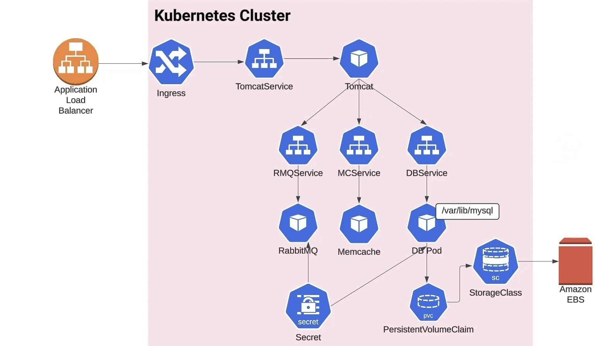
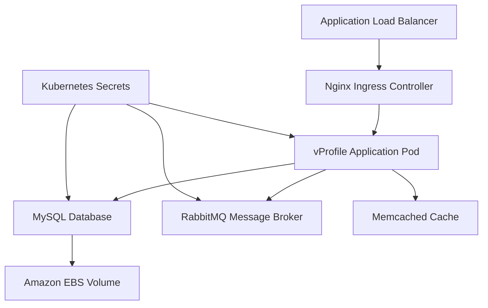

# VProfile Application - Kubernetes Orchestration

[](https://kubernetes.io/)
[](https://openjdk.java.net/)
[](https://spring.io/)
[](https://www.mysql.com/)

## 📋 Table of Contents

- [Overview](#overview)
- [Architecture](#architecture)
- [Technology Stack](#technology-stack)
- [Prerequisites](#prerequisites)
- [Project Structure](#project-structure)
- [Installation & Deployment](#installation--deployment)
- [Configuration](#configuration)
- [Monitoring & Observability](#monitoring--observability)
- [Security](#security)
- [Troubleshooting](#troubleshooting)
- [Performance Considerations](#performance-considerations)

## 🌟 Overview

**vProfile** is a production-ready, enterprise-grade Java web application orchestrated using Kubernetes. This project demonstrates modern cloud-native application deployment patterns, featuring a multi-tier architecture with persistent storage, caching layers, and message queuing systems.

The application implements a complete user profile management system using Spring MVC framework, integrated with enterprise-grade middleware components and deployed on Kubernetes with cloud-native best practices.

### Key Objectives

- **Cloud-Native Architecture**: Demonstrate microservices deployment patterns on Kubernetes
- **Production Readiness**: Implement enterprise-grade features like persistent storage, secrets management, and service discovery
- **Scalability**: Design for horizontal scaling and high availability
- **Observability**: Comprehensive monitoring and logging capabilities

## 🏗️ Architecture



### Component Architecture



### Infrastructure Components

#### **Frontend Layer**

- **AWS Application Load Balancer**: Distributes incoming traffic across multiple availability zones
- **Nginx Ingress Controller**: Manages HTTP/HTTPS routing and SSL termination
- **Custom Domain Integration**: CNAME-based domain routing configuration

#### **Application Layer**

- **Apache Tomcat 9.x**: Servlet container hosting the Java web application
- **Spring MVC Framework**: RESTful web services and MVC pattern implementation
- **Spring Security**: Authentication and authorization framework
- **Spring Data JPA**: Object-relational mapping and database abstraction

#### **Data Layer**

- **MySQL 8.0**: Primary relational database with ACID compliance
- **Amazon EBS**: Persistent block storage for database files
- **Persistent Volume Claims**: Kubernetes storage abstraction

#### **Middleware Layer**

- **RabbitMQ**: AMQP-based message broker for asynchronous communication
- **Memcached**: High-performance distributed memory caching system

#### **Infrastructure Layer**

- **Amazon EKS**: Managed Kubernetes control plane
- **EC2 Worker Nodes**: Compute instances for pod execution
- **AWS VPC**: Network isolation and security
- **Kubernetes Secrets**: Encrypted configuration management

## 🛠️ Technology Stack

### **Application Framework**

| Component        | Version      | Purpose                                |
| ---------------- | ------------ | -------------------------------------- |
| Java             | 17 LTS       | Runtime environment                    |
| Spring Framework | 6.0.11       | Core application framework             |
| Spring Boot      | 3.1.3        | Auto-configuration and embedded server |
| Spring Security  | 6.1.2        | Security framework                     |
| Spring Data JPA  | 3.1.2        | Data access abstraction                |
| Hibernate        | 7.0.0.Alpha3 | ORM framework                          |
| Apache Tomcat    | 9.x          | Servlet container                      |

### **Database & Storage**

| Component         | Version | Purpose            |
| ----------------- | ------- | ------------------ |
| MySQL             | 8.0+    | Primary database   |
| MySQL Connector/J | 8.0.33  | JDBC driver        |
| Amazon EBS        | gp3     | Persistent storage |

### **Middleware**

| Component | Version | Purpose             |
| --------- | ------- | ------------------- |
| RabbitMQ  | 3.x     | Message broker      |
| Memcached | 1.6+    | Distributed caching |

### **Infrastructure**

| Component     | Version | Purpose                 |
| ------------- | ------- | ----------------------- |
| Kubernetes    | 1.24+   | Container orchestration |
| Docker        | 20.10+  | Containerization        |
| Nginx Ingress | 1.8+    | Ingress controller      |
| AWS EKS       | 1.24+   | Managed Kubernetes      |

## 📋 Prerequisites

### **Infrastructure Requirements**

#### **Kubernetes Cluster**

- **Minimum**: 2 worker nodes with 4 vCPUs, 8GB RAM each
- **Recommended**: 3 worker nodes with 8 vCPUs, 16GB RAM each
- **Storage**: 20GB per node for system, 10GB for application storage
- **Network**: VPC with public/private subnets

#### **AWS Resources**

```yaml
Required AWS Services:
  - Amazon EKS (Kubernetes 1.24+)
  - Amazon EBS (gp3 storage class)
  - Application Load Balancer
  - VPC with Internet Gateway
  - NAT Gateway (for private subnets)
  - Route53 (for domain management)
```

### **Local Development Tools**

```bash
Required Tools:
  - kubectl (>= 1.24)
  - Docker (>= 20.10)
  - Maven (>= 3.8)
  - Java JDK 17
  - AWS CLI (>= 2.0)
  - Helm (>= 3.0) [Optional]
```

### **Network Configuration**

- **Ingress Ports**: 80, 443 (HTTP/HTTPS)
- **Application Port**: 8080
- **Database Port**: 3306 (internal only)
- **Cache Port**: 11211 (internal only)
- **Message Broker Port**: 5672 (internal only)

## 📁 Project Structure

```
vProfile-Kubernetes/
├── README.md                     # Project documentation
├── pom.xml                       # Maven project configuration
├── docker-compose.yml            # Local development environment
├── Images/                       # Architecture diagrams
│   └── Architecture.jpeg
├── src/                          # Application source code
│   ├── main/
│   │   ├── java/                 # Java application code
│   │   ├── resources/            # Configuration files
│   │   └── webapp/               # Web assets (JSP, CSS, JS)
│   └── test/                     # Unit and integration tests
├── target/                       # Compiled artifacts
│   └── vprofile-v2.war          # Deployable WAR file
└── kubedefs/                     # Kubernetes manifests
    ├── secret.yaml               # Application secrets
    ├── dbpvc.yaml               # Database persistent volume claim
    ├── dbdeploy.yaml            # MySQL deployment
    ├── dbservice.yaml           # MySQL service
    ├── mcdep.yaml               # Memcached deployment
    ├── mcservice.yaml           # Memcached service
    ├── rmqdeploy.yaml           # RabbitMQ deployment
    ├── rmqservice.yaml          # RabbitMQ service
    ├── appdeploy.yaml           # Application deployment
    ├── appservice.yaml          # Application service
    ├── appingress.yaml          # Ingress configuration
    ├── create.sh                # Deployment automation script
    └── delete.sh                # Cleanup automation script
```

## 🚀 Installation & Deployment

### **Phase 1: Cluster Preparation**

#### **Option A: AWS EKS Cluster**

```bash
# Create EKS cluster using eksctl
eksctl create cluster \
  --name vprofile-cluster \
  --version 1.24 \
  --region us-west-2 \
  --nodegroup-name vprofile-nodes \
  --node-type t3.medium \
  --nodes 2 \
  --nodes-min 2 \
  --nodes-max 4 \
  --managed
```

#### **Option B: KOPS Cluster**

```bash
# Set environment variables
export KOPS_STATE_STORE=s3://your-kops-state-store
export CLUSTER_NAME=vprofile.k8s.local

# Create cluster configuration
kops create cluster \
  --name $CLUSTER_NAME \
  --state $KOPS_STATE_STORE \
  --zones us-west-2a,us-west-2b \
  --node-count 2 \
  --node-size t3.medium \
  --master-size t3.medium

# Deploy cluster
kops update cluster $CLUSTER_NAME --yes
```

### **Phase 2: Prerequisites Installation**

#### **Install Nginx Ingress Controller**

```bash
# Add Nginx Ingress Helm repository
helm repo add ingress-nginx https://kubernetes.github.io/ingress-nginx
helm repo update

# Install Nginx Ingress Controller
helm install ingress-nginx ingress-nginx/ingress-nginx \
  --namespace ingress-nginx \
  --create-namespace \
  --set controller.service.type=LoadBalancer
```

#### **Verify Cluster Readiness**

```bash
# Check node status
kubectl get nodes -o wide

# Verify ingress controller
kubectl get pods -n ingress-nginx

# Check storage classes
kubectl get storageclass
```

### **Phase 3: Application Deployment**

#### **Clone Repository**

```bash
git clone https://github.com/your-username/Vprofile-Kubernetes.git
cd Vprofile-Kubernetes/kubedefs
```

#### **Configure Domain (Required)**

```bash
# Update ingress configuration with your domain
sed -i 's/vprofile.ravin.store/vprofile.yourdomain.com/g' appingress.yaml
```

#### **Deploy Application Stack**

```bash
# Method 1: Using automation script (Recommended)
chmod +x create.sh
./create.sh

# Method 2: Manual deployment
kubectl apply -f secret.yaml
kubectl apply -f dbpvc.yaml
kubectl apply -f dbdeploy.yaml
kubectl apply -f dbservice.yaml
kubectl apply -f mcdep.yaml
kubectl apply -f mcservice.yaml
kubectl apply -f rmqdeploy.yaml
kubectl apply -f rmqservice.yaml
kubectl apply -f appdeploy.yaml
kubectl apply -f appservice.yaml
kubectl apply -f appingress.yaml
```

### **Phase 4: DNS Configuration**

#### **Get Load Balancer Endpoint**

```bash
# Get the LoadBalancer endpoint
kubectl get ingress vpro-ingress
# or
kubectl get svc -n ingress-nginx
```

#### **Configure DNS**

```bash
# Create CNAME record with your DNS provider:
# Host: vprofile
# Value: <LoadBalancer-Endpoint>
# TTL: 300 seconds
```

## ⚙️ Configuration

### **Environment Variables**

```yaml
# Application Configuration
SPRING_PROFILES_ACTIVE: "production"
SERVER_PORT: "8080"
MYSQL_HOST: "vprodb.default.svc.cluster.local"
MYSQL_PORT: "3306"
MEMCACHE_HOST: "vprocache01.default.svc.cluster.local"
MEMCACHE_PORT: "11211"
RABBITMQ_HOST: "vpromq01.default.svc.cluster.local"
RABBITMQ_PORT: "5672"
```

### **Secrets Management**

```yaml
# Database Credentials
MYSQL_ROOT_PASSWORD: <base64-encoded>

# RabbitMQ Credentials
RABBITMQ_DEFAULT_USER: <base64-encoded>
RABBITMQ_DEFAULT_PASS: <base64-encoded>
```

### **Resource Limits**

```yaml
# Application Pod Resources
resources:
  requests:
    memory: "512Mi"
    cpu: "250m"
  limits:
    memory: "1Gi"
    cpu: "500m"

# Database Pod Resources
resources:
  requests:
    memory: "1Gi"
    cpu: "500m"
  limits:
    memory: "2Gi"
    cpu: "1000m"
```

## 📊 Monitoring & Observability

### **Health Checks**

```bash
# Application Health
curl -f http://vprofile.yourdomain.com/health

# Pod Status
kubectl get pods -o wide

# Service Endpoints
kubectl get endpoints

# Ingress Status
kubectl describe ingress vpro-ingress
```

### **Logging**

```bash
# Application Logs
kubectl logs -f deployment/app-deployment

# Database Logs
kubectl logs -f deployment/vprodb

# Init Container Logs
kubectl logs deployment/app-deployment -c init-mydb
```

### **Performance Monitoring**

```bash
# Resource Usage
kubectl top pods
kubectl top nodes

# Storage Usage
kubectl get pvc
kubectl describe pv
```

## 🔒 Security

### **Security Features Implemented**

- **Kubernetes Secrets**: Encrypted storage for sensitive configuration
- **RBAC**: Role-based access control for service accounts
- **Network Policies**: Micro-segmentation between services
- **Security Contexts**: Non-root containers with read-only file systems
- **Init Containers**: Secure initialization and dependency management

### **Security Best Practices**

```yaml
# Security Context Example
securityContext:
  runAsNonRoot: true
  runAsUser: 1001
  readOnlyRootFilesystem: true
  allowPrivilegeEscalation: false
  capabilities:
    drop:
      - ALL
```

## 🐛 Troubleshooting

### **Common Issues**

#### **Pod Startup Issues**

```bash
# Check pod events
kubectl describe pod <pod-name>

# Check init container logs
kubectl logs <pod-name> -c <init-container-name>

# Verify service discovery
kubectl exec -it <pod-name> -- nslookup <service-name>
```

#### **Storage Issues**

```bash
# Check PVC status
kubectl get pvc
kubectl describe pvc pv-db-claim

# Verify storage class
kubectl get storageclass
```

#### **Network Connectivity**

```bash
# Test service connectivity
kubectl exec -it <app-pod> -- curl http://<service-name>:<port>

# Check ingress configuration
kubectl get ingress -o yaml
```

#### **Database Connection Issues**

```bash
# Check MySQL pod logs
kubectl logs deployment/vprodb

# Verify database initialization
kubectl exec -it <mysql-pod> -- mysql -u root -p<password> -e "SHOW DATABASES;"
```

## ⚡ Performance Considerations

### **Optimization Strategies**

#### **Resource Optimization**

- **JVM Tuning**: Configure heap size based on available memory
- **Connection Pooling**: Optimize database connection pool size
- **Caching Strategy**: Implement multi-level caching with Memcached

#### **Scaling Configuration**

```yaml
# Horizontal Pod Autoscaler
apiVersion: autoscaling/v2
kind: HorizontalPodAutoscaler
metadata:
  name: vprofile-hpa
spec:
  scaleTargetRef:
    apiVersion: apps/v1
    kind: Deployment
    name: app-deployment
  minReplicas: 2
  maxReplicas: 10
  metrics:
    - type: Resource
      resource:
        name: cpu
        target:
          type: Utilization
          averageUtilization: 70
```

#### **Storage Performance**

- **EBS Optimization**: Use gp3 volumes with provisioned IOPS
- **Volume Scheduling**: Ensure pods are scheduled on same AZ as volumes

## 🤝 Contributing

### **Development Workflow**

1. Fork the repository
2. Create a feature branch (`git checkout -b feature/amazing-feature`)
3. Commit your changes (`git commit -m 'Add some amazing feature'`)
4. Push to the branch (`git push origin feature/amazing-feature`)
5. Open a Pull Request

### **Coding Standards**

- Follow Java coding conventions
- Use meaningful commit messages
- Add unit tests for new features
- Update documentation for API changes

### **Testing**

```bash
# Run unit tests
mvn test

# Run integration tests
mvn verify

# Build and test Docker image
docker build -t vprofile:test .
docker run --rm vprofile:test
```

---
