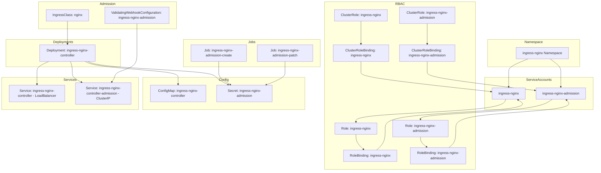

# Nginx-Ingress-Controller

```mermaid
flowchart TD
    subgraph Namespace
        A[ingress-nginx Namespace]
    end

    subgraph ServiceAccounts
        B[ingress-nginx]
        C[ingress-nginx-admission]
    end

    subgraph RBAC
        D[Role: ingress-nginx]
        E[Role: ingress-nginx-admission]
        F[ClusterRole: ingress-nginx]
        G[ClusterRole: ingress-nginx-admission]
        H[RoleBinding: ingress-nginx]
        I[RoleBinding: ingress-nginx-admission]
        J[ClusterRoleBinding: ingress-nginx]
        K[ClusterRoleBinding: ingress-nginx-admission]
    end

    subgraph Config
        L[ConfigMap: ingress-nginx-controller]
        M[Secret: ingress-nginx-admission]
    end

    subgraph Services
        N[Service: ingress-nginx-controller - LoadBalancer]
        O[Service: ingress-nginx-controller-admission - ClusterIP]
    end

    subgraph Deployments
        P[Deployment: ingress-nginx-controller]
    end

    subgraph Jobs
        Q[Job: ingress-nginx-admission-create]
        R[Job: ingress-nginx-admission-patch]
    end

    subgraph Admission
        S[IngressClass: nginx]
        T[ValidatingWebhookConfiguration: ingress-nginx-admission]
    end

    %% Relationships
    A --> B
    A --> C
    B --> D
    C --> E
    D --> H
    E --> I
    F --> J
    G --> K
    H --> B
    I --> C
    J --> B
    K --> C
    P --> N
    P --> O
    P --> L
    P --> M
    Q --> M
    R --> M
    T --> O
    S --> P
```
